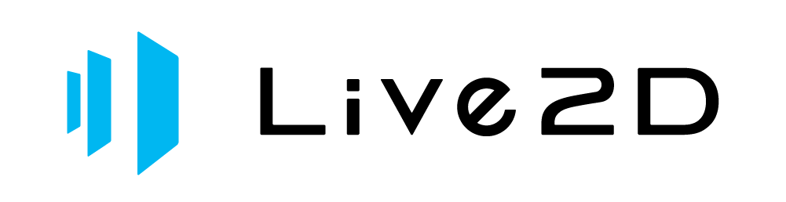

# HaloPress-Live2D

HaloPress-Live2D 是一个面向 WordPress 的 Live2D® Cubism 2 看板娘插件。它提供原生
WordPress 设置页、前台挂件、常用对话和工具栏，但不附带任何人物模型或
Live2D Cubism 运行时。

> 本项目不是 Live2D Inc. 的官方产品，也未获得其认证或推荐。Live2D 和
> Cubism 是其各自权利人的商标或注册商标。

<p>
  
</p>

**Powered by Live2D.** 本插件支持使用 Live2D® Cubism 2 技术制作的模型。
Live2D® 及其标志是 Live2D Inc. 的注册商标。本项目对标志的使用遵循
[Live2D 标志与商标使用指南](https://www.live2d.jp/zh-CHS/brand/)；标志本身不适用本项目的 GPL-3.0 许可证。

## 功能

- WordPress 原生设置页；
- 全站向访客显示，桌面端默认开启、移动端默认关闭；
- 左下角或右下角定位、尺寸和偏移配置；
- 单个 Cubism 2 模型 URL；
- 欢迎语和空闲随机提示语；
- 可配置的一言 JSON API；
- 一言、拍照、项目信息和关闭工具按钮；
- 可选拖动及关闭后唤醒按钮；
- 不包含模型上传、换装、模型切换、AI 对话和第三方彩蛋。

## 系统要求

- WordPress 6.4 或更高版本；
- PHP 7.4 或更高版本；
- 支持 WebGL 和现代 JavaScript 的浏览器；
- 由站点管理员合法取得的 Cubism 2 Web Core URL；
- 由站点管理员合法取得的 Cubism 2 `model.json` URL。

## 安装

1. 从 GitHub Releases 下载 `halopress-live2d.zip`。
2. 在 WordPress 后台进入“插件 → 安装插件 → 上传插件”。
3. 启用后进入“设置 → HaloPress-Live2D”。
4. 填写 Cubism 2 Core URL 和模型 JSON URL，保存设置。

两个资源字段为空时，插件不会向网站前台加载 CSS、JavaScript 或远程资源。

## 资源地址要求

模型地址必须指向 Cubism 2 的 `model.json` 或兼容的 `index.json`，并至少包含：

```json
{
  "model": "example.moc",
  "textures": ["texture_00.png"]
}
```

JSON、`.moc` 和贴图服务器必须允许浏览器跨域访问（CORS）。插件直接由访客
浏览器访问这些地址，不通过 WordPress 服务端代理，也不会复制或保存资源。

管理员填写的 Cubism 2 Core URL 指向 JavaScript，拥有在网站访客浏览器中执行
代码的能力。只应使用管理员信任且具有合法授权的来源。

## 隐私与外部服务

- Cubism Core、模型 JSON、MOC 和贴图会从管理员填写的地址加载；
- 一言 API 仅在访客主动点击“一言”按钮时请求；
- 插件不会把一言请求代理到 WordPress 服务端；
- 插件不收集、上传或集中保存访客数据；
- 显示状态和拖动位置只保存在访客浏览器的 `localStorage` 中。

网站管理者应根据其配置的第三方服务更新网站隐私政策。

## 许可证边界

HaloPress-Live2D 自有代码以及从上游 GPL 代码修改的部分以 GPL-3.0 发布，详见
[`LICENSE`](LICENSE)。项目基于
[stevenjoezhang/live2d-widget](https://github.com/stevenjoezhang/live2d-widget)
的交互思路进行 WordPress 二次开发，并保留上游鸣谢。

本仓库及 Release ZIP **不包含**：

- Live2D 人物模型；
- 模型贴图、动作、表情或音频；
- Live2D Cubism Core；
- Live2D Cubism SDK、Framework、Samples 或其编译产物；
- 第三方模型资源地址预设。

模型、贴图、动作和 Cubism 运行时分别受其权利人许可证约束，GPL-3.0 不会授予
使用这些材料的权利。使用者必须自行确认并遵守适用条款：

- [Live2D Proprietary Software License Agreement](https://www.live2d.com/eula/live2d-proprietary-software-license-agreement_cn.html)
- [Live2D Open Software License Agreement](https://www.live2d.com/eula/live2d-open-software-license-agreement_cn.html)
- [Live2D SDK 发布许可证说明](https://www.live2d.com/en/sdk/license/)

允许用户配置任意模型或运行时的软件可能涉及 Live2D 对“Expandable Application”
等类别的认定。公开发布或商业使用前，建议向 Live2D Inc. 或专业法律顾问确认。
本说明不构成法律意见。更多信息见 [`THIRD-PARTY-NOTICES.md`](THIRD-PARTY-NOTICES.md)。

## 项目结构

```text
HaloPress-Live2D/
├── halopress-live2d.php       # WordPress 插件入口
├── includes/                  # 插件核心和原生设置页
├── assets/                    # WordPress 后台样式
├── live2d-widget/             # GPL-3.0 前台挂件与 Cubism 2 API 适配器
├── tools/                     # 本地发布脚本
├── uninstall.php              # 卸载清理
├── LICENSE                    # GPL-3.0
└── THIRD-PARTY-NOTICES.md     # 第三方和许可证边界
```

## 开发与打包

前台代码不需要 npm 依赖。JavaScript 可以使用 Node.js 做语法检查：

```powershell
node --check live2d-widget/widget.js
```

在 Windows PowerShell 中生成可安装 ZIP：

```powershell
powershell -ExecutionPolicy Bypass -File tools/build-release.ps1
```

输出文件为 `release/halopress-live2d.zip`。GitHub tag（例如 `v1.0.0`）也会触发
自动检查和 Release 打包。

## 鸣谢

- [stevenjoezhang/live2d-widget](https://github.com/stevenjoezhang/live2d-widget)
- WordPress 开源项目及其贡献者
